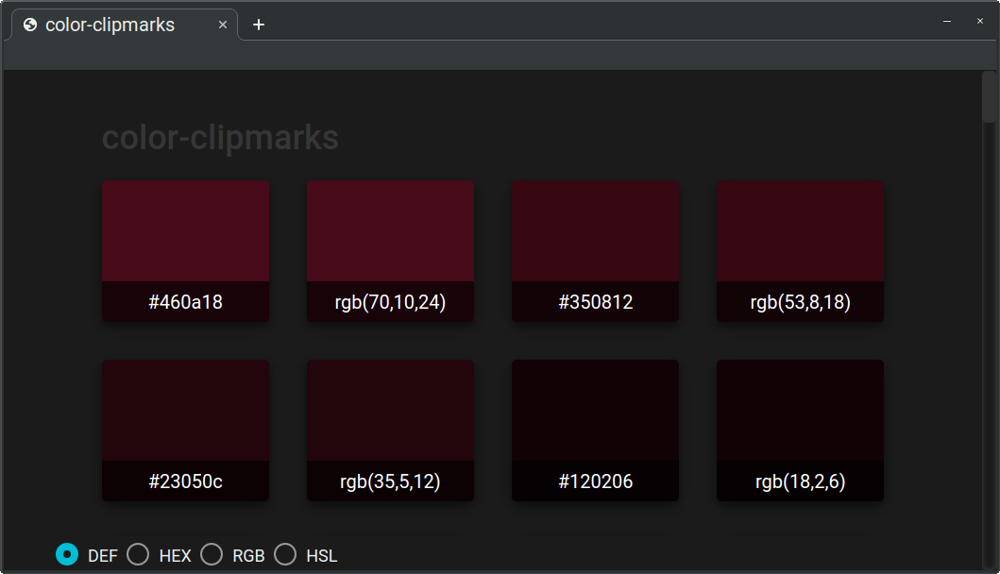

# color-clipmarks-v0.90

Color Clipmarks is a tool to help you quickly copy, paste, and preview a list of color codes in a single window. (supports Hex, RGB, and HSL formats)

## About

I have a habit of saving color codes... a lot of them! Colors that I use often, branding colors that I may need to reference at some point, and colors that I would like to use in a future project.

Over time, these really start to add up and become difficult to manage, organize, and use in a productive manner. I wanted a simple and easy to use tool that I could quickly access on any device, without having to rely on internet access and the overhead cost of premium tools. So, I decided to build this tool.

It's a work in progress, with much more to do in the future, but it's functional. Let me know what you think! 

- find me on twitter - [@imchriskitchens](https://twitter.com/imchriskitchens)

[Color-Clipmarks](https://github.com/imchriskitchens/color-clipmarks)
